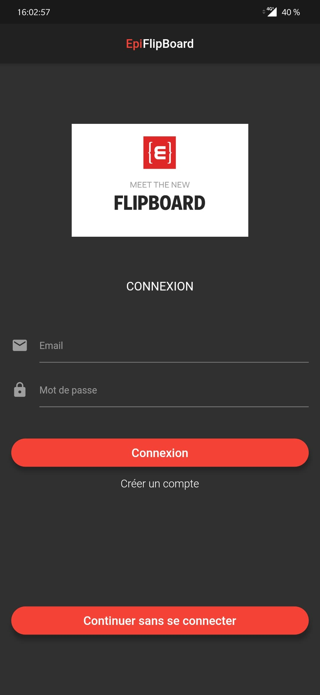
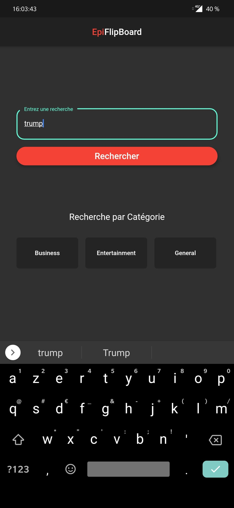
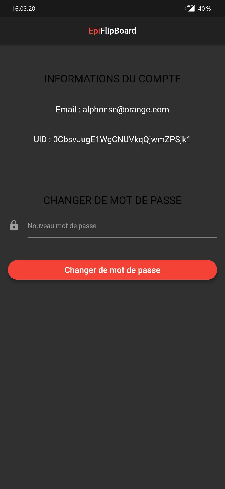

# YEP_project3_2019

To launch EPIFLIPBOARD

## Launch from APK
ctrl+c / ctrl+v Apk from ./apk/epiflipboard.apk on your smartphone

## Launch from PC
Make sure that "flutter" is installed on your computer

plug your smartphone on your PC

Open the folder and execute this command in your shell:

flutter run

### Login Page

### Home Page

### Article View Page

### Search Page

### Search Result Page

### Account Page

## You can find a web version in the /Web folder
To launch web version (beta)

Make sure that "docker-compose" is installed on your computer
Open the folder Delivery and execute this command in your shell:

sudo docker-compose up --build

After building you can launch your browser and go to this address "http://localhost:3000/"